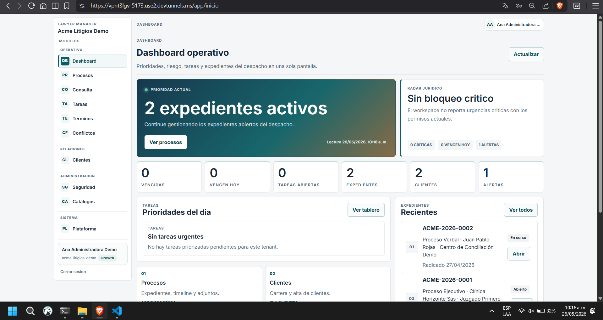
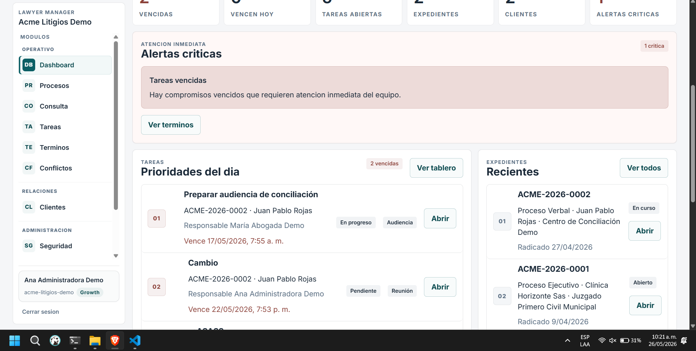
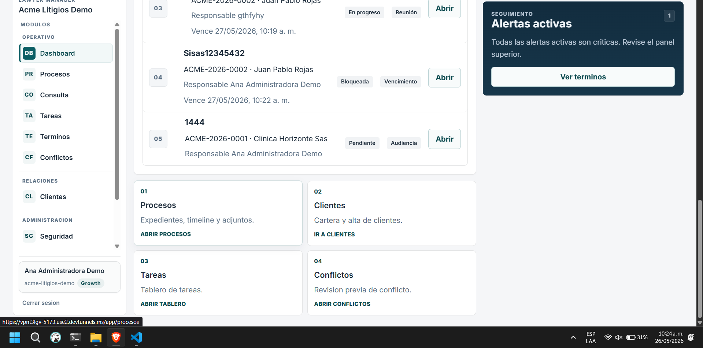

# Retrospectiva de la ruta de Inicio (Dashboard)

## Alcance

Análisis de la pantalla de inicio/dashboard observada en las capturas compartidas de la ruta principal posterior al login.

### Evidencia visual

Vista principal del dashboard:

Estado con bloque de alerta critica visible:

Zona de accesos inferiores y continuidad de modulos:

## Objetivo del usuario

Como usuario operativo del despacho, quiero entrar y entender en segundos:

- Estado actual del trabajo (riesgos, vencimientos, alertas, carga).
- Qué debo atender primero.
- A dónde ir sin dudar ni recorrer elementos repetidos.

## Resumen ejecutivo

La pantalla muestra buena cantidad de contexto operativo y deja visible la navegación principal, pero hoy pierde claridad por duplicación de accesos, jerarquía visual competida y ambigüedad entre secciones que parecen distintas pero llevan al mismo destino.

Hay señales de redundancia y una sensación general de confusión por exceso de rutas de entrada.

## Ruta observada

- Ruta visible en barra: `/app/inicio`

## Lectura como usuario

### Lo que funciona

- La navegación lateral está siempre visible y permite saltar rápido entre módulos.
- El dashboard ofrece un resumen de estado con métricas, prioridades y expedientes recientes.
- Existen CTA directos para actuar: “Ver procesos”, “Ver tablero”, “Ver todos”, “Abrir”.

### Lo que genera fricción

- Hay múltiples accesos para la misma intención (ejemplo: Tareas aparece en menú lateral, bloque de prioridades, tarjeta de atajo y botón de tablero).
- La pantalla compite entre muchos bloques con peso similar; cuesta detectar qué es realmente prioritario.
- La ruta en español no es mala por sí misma, pero debe ser consistente con toda la arquitectura de rutas y con criterios técnicos del producto.
- Algunas etiquetas generan dudas de normalización editorial (por ejemplo, “Terminos” sin tilde).

## Hallazgos principales

### 1. Redundancia de navegación hacia el mismo destino

Se observa duplicación de puntos de entrada para módulos como Tareas, Procesos y Clientes:

- Menú lateral.
- Tarjetas de resumen.
- Bloques de prioridad o recientes.
- Tarjetas inferiores de acceso rápido.

Impacto:

- Incremento de carga cognitiva para decidir por dónde entrar.
- Menor claridad del flujo principal de trabajo.
- Riesgo de mantenimiento UX: cambios futuros deben sincronizarse en muchos lugares.

Evidencia relacionada:

### 2. Jerarquía de información competida

Convivencia de:

- Banner principal.
- Tarjetas KPI.
- Bloques de prioridades.
- Paneles de expedientes.
- Alertas.
- Accesos rápidos.

Impacto:

- El usuario escanea más tiempo para encontrar la siguiente acción.
- Lo urgente puede perderse entre contenido informativo y accesos secundarios.

### 3. Ruta en español: decisión válida, pero requiere estándar explícito

`/app/inicio` es comprensible para usuario hispanohablante. El problema aparece si:

- Otras rutas usan inglés o mezclas de idioma.
- No hay una convención definida para nombres de rutas (idioma, slug, pluralización, acentos, guiones).

Impacto:

- Inconsistencia técnica y de producto.
- Dificultad al escalar documentación, QA automatizado y analítica por rutas.

### 4. Posible inconsistencia de estado entre bloques de alerta

Entre capturas se perciben estados distintos (escenario sin bloqueo crítico vs bloque de alertas críticas activas). Esto puede ser normal por cambio temporal de datos, pero en experiencia de usuario hay que cuidar que:

- El estado global y los contadores siempre cuenten la misma historia.
- No aparezcan señales contradictorias dentro de la misma sesión.

Impacto:

- Menor confianza en los indicadores del panel.

Evidencia relacionada:

### 5. Calidad editorial y microcopy

Detalles como “Terminos” sin tilde o títulos repetidos con estructura similar pueden parecer menores, pero afectan percepción de calidad.

Impacto:

- Menor sensación de producto pulido.
- Más esfuerzo de lectura cuando hay muchas piezas textuales.

## Recomendaciones priorizadas

### Prioridad alta

- Definir una acción primaria del dashboard: una sola entrada dominante para “lo siguiente que debo hacer”.
- Reducir duplicación funcional: si varios botones llevan al mismo lugar, conservar solo el más claro por contexto.
- Alinear estados de alerta y métricas con una única fuente visible de verdad en pantalla.

### Prioridad media

- Rediseñar jerarquía visual por niveles:
  - Nivel 1: urgencias y acción inmediata.
  - Nivel 2: resumen operativo (KPI).
  - Nivel 3: navegación secundaria y accesos rápidos.
- Estandarizar nombres de botones para que cada verbo represente una intención distinta.

### Prioridad baja

- Crear una guía editorial de UI (acentos, mayúsculas, tono, terminología).
- Documentar convención oficial de rutas y mantenerla en todo el producto.

## Propuesta concreta para tus 2 dudas clave

### A. “La ruta está en español”

Respuesta corta: no es un error por sí sola.

Recomendación:

- Mantener español en rutas si el producto es 100% español.
- Evitar mezcla con inglés.
- Usar slugs consistentes y sin acentos para robustez técnica.

### B. “Hay muchas cosas que redirigen a lo mismo”

Sí, es una oportunidad clara de mejora. No se trata de quitar opciones por quitar, sino de:

- Mantener un camino principal por tarea frecuente.
- Dejar caminos secundarios solo cuando aportan contexto diferente.
- Eliminar duplicados que no agregan valor nuevo.

## Soporte externo (criterios que respaldan correcciones)

### 1. Navegación consistente

WCAG 2.1 SC 3.2.3 indica que mecanismos repetidos de navegación deben conservar orden y predictibilidad para facilitar orientación.

Referencia:

- https://www.w3.org/WAI/WCAG21/Understanding/consistent-navigation.html

### 2. Consistencia y estándares

Nielsen Heuristic #4: usuarios no deberían preguntarse si acciones distintas significan lo mismo.

Referencia:

- https://www.nngroup.com/articles/ten-usability-heuristics/

### 3. Reconocimiento sobre memoria y diseño minimalista

Nielsen Heuristic #6 y #8: reducir carga de memoria y evitar información/acciones redundantes que compiten con lo esencial.

Referencia:

- https://www.nngroup.com/articles/ten-usability-heuristics/

