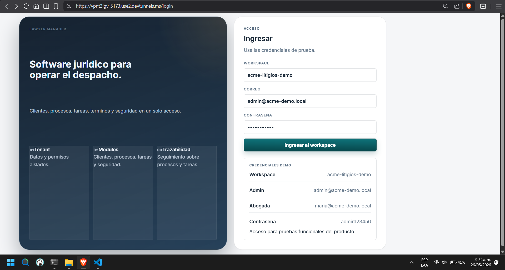
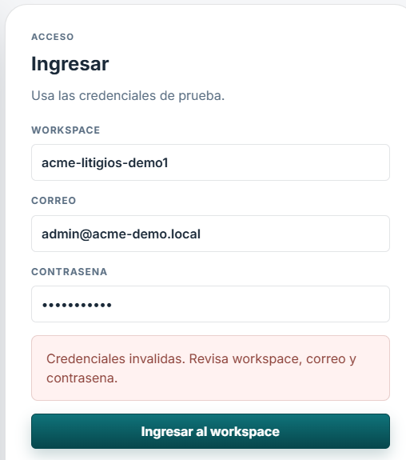

# Retrospectiva de la ruta /login

## Alcance

Análisis de la pantalla de acceso visible en `imgs/login.png` y del estado de validación mostrado en `imgs/login-validation.png`.

### Evidencia visual

Pantalla principal del login:

Estado con error de validación:

## Objetivo del usuario

El usuario busca entrar al workspace con rapidez, confirmar que está usando el entorno correcto y resolver cualquier error sin fricción ni dudas sobre qué campo falló.

## Resumen ejecutivo

La pantalla cumple la función básica de autenticación y transmite una jerarquía visual clara entre el panel informativo y el formulario. Sin embargo, la experiencia todavía se siente demasiado genérica en dos puntos: el panel lateral comunica poco valor real y el sistema de error no ayuda a diagnosticar el problema con precisión.

## Ruta y composición

- Ruta observada: `/login`
- Estructura principal:
  - Panel informativo izquierdo con propuesta de valor, tres bloques descriptivos y fondo degradado.
  - Panel derecho con formulario de acceso.
  - Bloque inferior con credenciales de demo.
- Campos observados:
  - Workspace
  - Correo
  - Contraseña
  - Botón de envío: “Ingresar al workspace”
- Estados observados:
  - Estado normal del formulario.
  - Estado de error al enviar credenciales inválidas.

## Lectura como usuario

### Lo que funciona

- La intención de la pantalla es clara: entrar al workspace.
- El formulario está bien priorizado visualmente y el botón principal destaca con suficiente peso.
- El bloque de credenciales demo reduce la barrera de prueba para usuarios nuevos.

### Lo que genera fricción

- El panel de información se percibe poco desarrollado. La promesa del producto existe, pero no explica con suficiente detalle por qué este sistema es valioso o distinto.
- Hay sensación de espacios inconsistentes entre títulos, campos y bloques auxiliares. Eso hace que la interfaz se vea menos pulida de lo que podría.
- El error de acceso es demasiado general: indica que las credenciales son inválidas, pero no aclara si el problema está en el workspace, el correo o la contraseña.
- No hay opción visible para mostrar u ocultar la contraseña. No es un defecto crítico, pero sí reduce comodidad cuando el usuario quiere verificar lo que escribió.

## Validaciones observadas

- El formulario valida al enviar.
- La validación actual comunica un fallo global, no un error puntual por campo.
- El mensaje visible es útil como aviso general, pero no suficiente para corregir rápido.

### Evidencia del error

El estado de error se muestra como un mensaje general al pie del formulario, sin destacar de forma explícita qué campo falló.

## Hallazgos

### 1. Panel informativo demasiado simple

El panel izquierdo cumple un rol de marketing, pero hoy aporta poca información concreta. Los tres bloques inferiores se sienten más decorativos que explicativos, y el contenido no construye una historia clara sobre beneficios, alcance o confianza.

Impacto:
- Menor percepción de producto sólido.
- Menor ayuda para nuevos usuarios que todavía no entienden el valor del sistema.
- Menos consistencia visual si el texto y los bloques no tienen un sistema de espaciado bien resuelto.

### 2. Error de acceso poco específico

El mensaje “Credenciales inválidas. Revisa workspace, correo y contraseña.” orienta, pero no identifica qué campo está fallando. Desde la perspectiva del usuario, eso obliga a revisar todo otra vez.

Impacto:
- Más tiempo para corregir.
- Más intentos fallidos.
- Riesgo de interpretar el error como problema del sistema y no del dato ingresado.

### 3. Falta un control para ver la contraseña

No tener visibilidad de la contraseña puede ser aceptable en algunos contextos, pero en login suele ayudar mucho a reducir errores de tipeo. La ausencia del control no rompe el flujo, aunque sí le quita una capa de confort.

Impacto:
- Más errores por escritura accidental.
- Menos confianza al completar el campo en equipos compartidos o con contraseñas largas.

## Recomendaciones priorizadas

### Prioridad alta

- Mostrar errores por campo o, como mínimo, destacar el campo que falló cuando el backend devuelve un rechazo.
- Mantener el mensaje breve, claro y accionable. Ejemplo: indicar si el workspace no existe, si el correo no coincide o si la contraseña es incorrecta.
- Marcar visualmente el campo afectado y conservar el valor ingresado para evitar rehacer el formulario.

### Prioridad media

- Reescribir el panel informativo con más contexto real del producto.
- Reducir la sensación de vacío y mejorar la consistencia de separaciones verticales y horizontales.
- Reforzar jerarquía con una sola promesa principal y menos bloques genéricos.

### Prioridad baja

- Agregar un botón de mostrar/ocultar contraseña.
- Complementarlo con una etiqueta accesible y estado claro para teclado y lectores de pantalla.

## Criterios de soporte externo

### 1. Los errores deben decir qué salió mal

WCAG 2.1, criterio 3.3.1, pide que cuando se detecta un error automáticamente, el campo en error quede identificado y el problema se describa en texto. Esto respalda que un mensaje genérico no es suficiente cuando el usuario necesita corregir rápido.

Referencia:
- https://www.w3.org/WAI/WCAG21/Understanding/error-identification.html

### 2. Los mensajes deben ser cercanos, claros y accionables

Nielsen Norman Group recomienda que los errores se muestren cerca de su origen, con lenguaje humano, sin tecnicismos, y con información que ayude a resolver el problema. También sugiere no depender solo de color o de una alerta global.

Referencia:
- https://www.nngroup.com/articles/error-message-guidelines/

### 3. El uso de mostrar contraseña es una mejora de usabilidad, no una obligación

La ausencia del botón no es necesariamente mala práctica por sí sola. Lo relevante es que, si el campo es propenso a error o el contexto requiere precisión, dar la opción de revelar la contraseña suele mejorar la experiencia. En este caso lo trataría como mejora, no como bloqueo.

## Conclusión

La pantalla de login está bien encaminada funcionalmente, pero todavía puede ganar bastante en claridad, confianza y eficiencia. El mayor problema no es visual, sino de diagnóstico: el usuario sabe que falló, pero no sabe qué debe corregir. Si se arregla eso y se refuerza el panel informativo, la pantalla subiría mucho de calidad percibida.

## Próximo paso sugerido

La siguiente revisión debería documentar el flujo posterior al login para ver si la consistencia de navegación, vacíos de estado y mensajes de sistema mantiene el mismo nivel de calidad.
