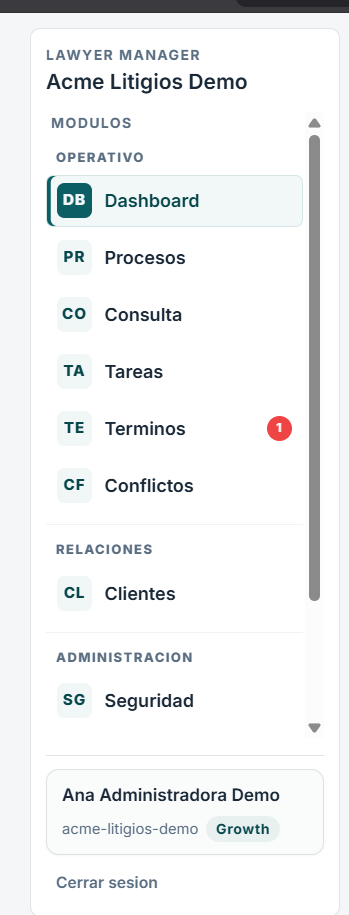

# Retrospectiva del menú lateral

## Alcance

Análisis del menú lateral visible en la captura `imgs/menu.png`.

### Evidencia visual

## Objetivo del usuario

El usuario necesita orientarse rápido, entender qué espacio está usando, encontrar módulos frecuentes sin esfuerzo y salir de la sesión con una acción clara y visible.

## Resumen ejecutivo

El menú lateral funciona como columna vertebral de navegación, pero hoy tiene tres problemas de lectura: la identidad del espacio no se explica, el cierre de sesión tiene poco peso visual y la nomenclatura mezcla pequeños descuidos de redacción con una jerarquía todavía muy básica.

## Lectura como usuario

### Lo que funciona

- La estructura general del menú es familiar y fácil de reconocer.
- Los módulos están agrupados por secciones, lo que ayuda a ubicar categorías.
- El estado activo de `Dashboard` se identifica bien.
- El acceso a `Cerrar sesion` existe y está presente en el mismo lugar donde el usuario espera encontrarlo.

### Lo que genera fricción

- `Acme Litigios Demo` aparece como identidad principal del espacio, pero no queda claro si es nombre del tenant, workspace, instancia de prueba o proyecto.
- Ese nombre no se anticipa en el login, así que para un usuario nuevo puede sentirse “sacado de contexto”.
- `Cerrar sesion` está visualmente demasiado opaco frente al resto de opciones. No compite con la navegación principal, pero tampoco se percibe como una salida clara.
- Hay detalles de redacción que bajan la percepción de cuidado, por ejemplo `Terminos` sin tilde y `Cerrar sesion` sin acento.
- La barra lateral tiene scroll interno, lo cual sugiere que hay más opciones de las que entran en pantalla y puede ocultar contenido relevante si el usuario no lo nota.

## Hallazgos principales

### 1. Identidad del espacio poco explicada

El nombre `Acme Litigios Demo` parece ser el nombre del workspace o del entorno, pero la interfaz no aclara su rol. Para un usuario nuevo, eso deja una duda básica: qué representa exactamente ese texto y si puede cambiarlo.

Impacto:

- Menor confianza en el contexto de trabajo.
- Sensación de desalineación entre login y navegación interna.
- Dificultad para entender si se está en una demo, un tenant o un entorno real.

### 2. Cierre de sesión poco visible

`Cerrar sesion` está presente, pero su jerarquía visual es baja frente al resto del menú. En una interfaz con múltiples módulos y datos sensibles, salir debería ser fácil de encontrar sin tener que escanear mucho.

Impacto:

- Mayor fricción para terminar la sesión.
- Riesgo de que el usuario no perciba la acción de salida con suficiente claridad.
- Menor sensación de control.

### 3. Detalles editoriales que reducen pulido

Aunque son detalles pequeños, los textos del menú deben ser consistentes entre sí. En este estado aparecen pequeñas inconsistencias de ortografía y estilo.

Impacto:

- Menor percepción de producto maduro.
- Menor calidad aparente en una zona que el usuario ve todo el tiempo.

### 4. Menú largo con scroll interno

El menú contiene más elementos de los que entran en la altura visible. Eso no es necesariamente malo, pero sí obliga a descubrir el scroll y recordar qué hay más abajo.

Impacto:

- Más carga de memoria.
- Posibilidad de que algunas opciones queden menos visibles de lo esperado.

## Recomendaciones priorizadas

### Prioridad alta

- Aclarar qué es `Acme Litigios Demo` con una etiqueta secundaria o un subtítulo descriptivo.
- Confirmar que el texto del espacio sea consistente con el login y con cualquier selector de tenant o workspace.
- Corregir `Cerrar sesion` a `Cerrar sesión` y revisar el resto de tildes del menú.

### Prioridad media

- Dar más presencia al cierre de sesión sin convertirlo en elemento dominante.
- Si el producto maneja varios entornos o tenants, mostrar una explicación breve del contexto actual.
- Revisar si el scroll interno puede reorganizarse para que las opciones más frecuentes queden visibles sin desplazamiento.

### Prioridad baja

- Afinar microcopy y ortografía en todos los labels del menú.
- Evaluar si ciertos módulos podrían agruparse o reordenarse según frecuencia real de uso.

## Soporte externo

### 1. Consistencia de identificación

WCAG 2.1 SC 3.2.4 indica que las componentes con la misma funcionalidad deben identificarse consistentemente. Si el espacio, tenant o workspace se repite en varias pantallas, su nombre debe mantenerse estable y claro.

Referencia:

- https://www.w3.org/WAI/WCAG21/Understanding/consistent-identification.html

### 2. Consistencia y estándares

Nielsen Heuristic #4 recomienda que los usuarios no tengan que preguntarse si distintas palabras significan lo mismo. Esto aplica directamente al naming del espacio y a acciones repetidas como salir de sesión.

Referencia:

- https://www.nngroup.com/articles/ten-usability-heuristics/

### 3. Reconocimiento sobre memoria

Nielsen Heuristic #6 apoya que los elementos visibles reduzcan la necesidad de recordar dónde está cada cosa. Un sidebar claro, con jerarquía firme y labels consistentes, ayuda a eso.

Referencia:

- https://www.nngroup.com/articles/ten-usability-heuristics/

## Conclusión

El menú lateral está bien encaminado como estructura, pero todavía necesita una capa de explicación y pulido. Lo más importante no es agregar más elementos, sino hacer explícito qué espacio se está usando, reforzar la salida de sesión y corregir detalles de texto que hoy restan confianza.
